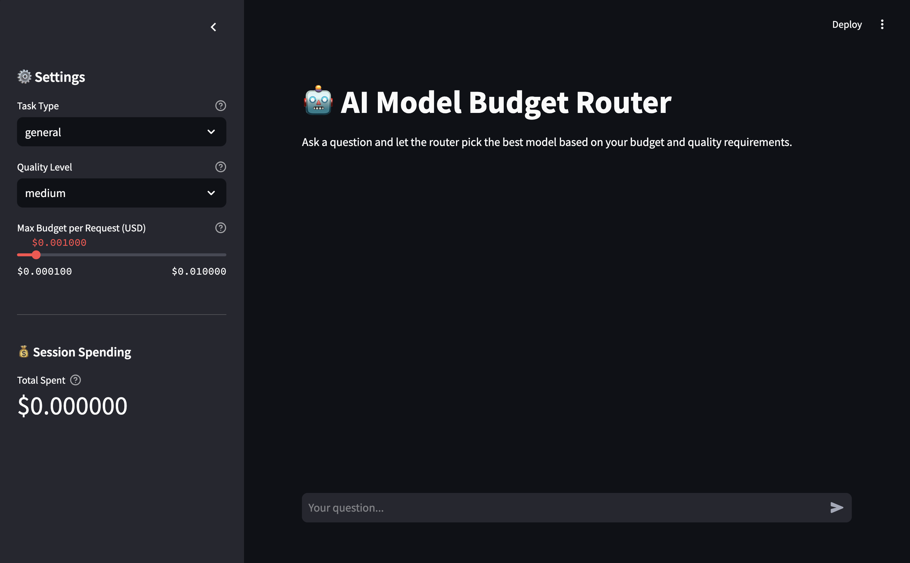

# AI Model Budget Router

A web app that routes AI prompts to the best LLM based on budget, task type, and quality level. Uses the Groq API for fast inference.

## Demo




## Why This Project?

This project demonstrates:
- **Full-Stack Development** - FastAPI backend + Streamlit frontend
- **API Integration** - Groq LLM API with proper error handling and retry logic
- **Cost Optimization** - Smart routing algorithm that balances quality and budget constraints
- **Production-Ready Code** - Pydantic validation, structured logging, clean architecture
- **Real-World Problem Solving** - Managing AI API costs is a real challenge for startups and developers

## Features

- **Smart Routing** - Selects the optimal model based on task type (code, email, summarize, general), quality requirements, and budget constraints
- **Budget Guard** - Prevents requests that would exceed your specified budget before making API calls
- **Cost Tracking** - Logs every request with estimated and actual costs in JSONL format for analysis
- **Interactive Chat UI** - Streamlit-based chat interface with session state, routing details, and cost breakdown
- **Usage Dashboard** - ⚠️ Planned (not yet implemented) - Will show statistics on model usage and spending
- **Multiple Quality Tiers** - Choose between high, medium, and low quality based on your needs
- **Task-Specific Optimization** - Models are scored higher for tasks they excel at (e.g., LLaMA 3.3 70B gets +15 bonus for code, email, and summarize tasks)

## Tech Stack

**Backend**:
- FastAPI - Modern Python web framework with automatic OpenAPI docs
- Pydantic - Data validation and settings management
- HTTPX - Async HTTP client for LLM API requests
- uvicorn - Lightning-fast ASGI server

**Frontend**:
- Streamlit - Interactive web UI with real-time updates
- Requests - HTTP client for backend communication

**LLM API**:
- Groq - Ultra-fast inference API (up to 750 tokens/sec)
- Models: LLaMA 3.3 70B, GPT-OSS 120B, GPT-OSS 20B, LLaMA 3.1 8B

## Prerequisites

- **Python 3.13** — Python 3.14 is not supported due to `pydantic-core` incompatibility
- **Groq API Key** — Get a free key at [console.groq.com](https://console.groq.com)

## Setup

### 1. Clone & install dependencies

```bash
git clone https://github.com/YOUR_USERNAME/ai-model-api-budget-router.git
cd ai-model-api-budget-router
python3.13 -m venv .venv
source .venv/bin/activate
pip install -r requirements.txt
```

### 2. Configure API key

```bash
cp .env.example .env
# Edit .env and add your Groq API key
```

### 3. Run the backend

```bash
uvicorn backend.app:app --reload
```

The API will be available at `http://localhost:8000`. Check `http://localhost:8000/docs` for the interactive API documentation.

### 4. Run the frontend

```bash
streamlit run frontend/app.py
```

For the usage dashboard:

```bash
streamlit run frontend/dashboard.py
```

## Example Output

When you send a prompt, the router returns detailed information about the selected model and costs:

```json
{
  "model": "llama-3.3-70b-versatile",
  "response": "Quicksort is a divide-and-conquer sorting algorithm that works by selecting a 'pivot' element...",
  "estimated_cost": 0.0045,
  "actual_cost": 0.0042,
  "tokens_used": 523,
  "routing_reason": "Best quality match for code tasks within budget"
}
```

The chat UI displays this information in user-friendly expandable sections:
- **Model Selection Details**: Selected model name and routing reason
- **Cost Breakdown**: Estimated vs actual cost with variance percentage
- **Token Usage**: Total tokens consumed (input + output)
- **Session Spending Tracker**: Running total in sidebar

## API Endpoints

| Endpoint | Method | Description |
|----------|--------|-------------|
| `/health` | GET | Health check |
| `/route` | POST | Route a prompt to the best model |
| `/stats` | GET | Get usage statistics |

### Example request

```bash
curl -X POST http://localhost:8000/route \
  -H "Content-Type: application/json" \
  -d '{"prompt": "Explain quicksort", "task_type": "code", "budget": 0.01, "quality": "high"}'
```

## Available Models (via Groq)

| Model | Quality Score | Input Price | Output Price | Strengths | Max Tokens |
|-------|--------------|-------------|--------------|-----------|-----------|
| LLaMA 3.3 70B Versatile | 88 | $0.00059/M | $0.00079/M | General, Code, Summarize | 32,768 |
| GPT-OSS 120B | 85 | $0.00015/M | $0.00060/M | General, Code, Email | 65,536 |
| GPT-OSS 20B | 68 | $0.000075/M | $0.00030/M | General, Email | 65,536 |
| LLaMA 3.1 8B Instant | 55 | $0.00005/M | $0.00008/M | General | 131,072 |

*Prices per million tokens. All models via Groq API.*

### Quality Thresholds

When you select a quality level, the router filters models:
- **Low** (0+): All models available
- **Medium** (60+): Excludes LLaMA 8B Instant
- **High** (75+): Only 70B+ models (LLaMA 3.3 70B, GPT-OSS 120B)

### How Routing Works

1. **Filter by quality**: Remove models below the quality threshold
2. **Filter by budget**: Estimate cost and remove unaffordable models
3. **Score candidates**:
   - Base score = model's quality score
   - **+15 bonus** if task type matches model strengths
   - Example: LLaMA 70B with "code" task → 88 + 15 = 103
4. **Select best**: Highest score wins; cheapest breaks ties
5. **Fallback**: If no model meets quality threshold, select cheapest affordable model

## Project Structure

```
backend/
  app.py              # FastAPI server
  routing.py          # Model selection logic
  model_config.py     # Model definitions and pricing
  cost_estimator.py   # Token estimation and cost calculation
  budget_guard.py     # Budget validation
  llm_client.py       # Groq API client
  logging_service.py  # JSONL request logging
  schemas.py          # Pydantic data models
frontend/
  app.py              # Streamlit main UI
  dashboard.py        # Usage dashboard
logs/                 # Request logs (JSONL)
```

## Roadmap & Future Features

Planned enhancements to make this project even more powerful:

### Dashboard Implementation (High Priority)
- ✅ Backend API ready (`GET /stats`)
- 📋 TODO: Implement `frontend/dashboard.py`
  - Real-time usage metrics (requests, costs, avg cost per request)
  - Model usage distribution (pie/bar charts)
  - Cost trends over time (line chart)
  - Request history table with filtering
  - Auto-refresh every 5 seconds

### Advanced Budget Management
- **Monthly/Daily Budget Limits**: Set recurring budget caps with auto-reset
- **Budget Alerts**: Notifications when approaching limits (80%, 90%, 100%)
- **Cost Forecasting**: Predict monthly costs based on usage patterns
- **Budget per Task Type**: Separate budgets for code, email, summarize tasks

### Model Comparison & A/B Testing
- **Side-by-side Comparison**: Get responses from multiple models simultaneously
- **Response Quality Voting**: Rate responses to improve routing over time
- **Model Performance Analytics**: Track which models perform best for each task type
- **Custom Routing Rules**: Override default routing with user-defined preferences

### Analytics & Insights
- **Token Usage Trends**: Daily/weekly/monthly token consumption charts
- **Cost Optimization Suggestions**: Identify opportunities to reduce costs
- **Task Type Distribution**: See which task types you use most
- **Response Time Metrics**: Track API latency and response times
- **Quality vs Cost Trade-off Analysis**: Visualize quality/cost relationships

### Multi-User Support
- **User Accounts**: Authentication with separate budgets per user
- **Team Workspaces**: Shared budgets and chat history for teams
- **Role-based Access**: Admin, user, viewer roles with different permissions
- **Usage Attribution**: Track costs per user/team member

### Advanced Routing Features
- **Custom Model Weights**: Fine-tune scoring algorithm per user preferences
- **Model Blacklist/Whitelist**: Exclude or prefer specific models
- **Conditional Routing**: Different routing rules based on time, budget remaining, etc.
- **Manual Model Override**: Option to manually select a specific model
- **Hybrid Routing**: Combine multiple models' outputs for critical tasks

## License

MIT
