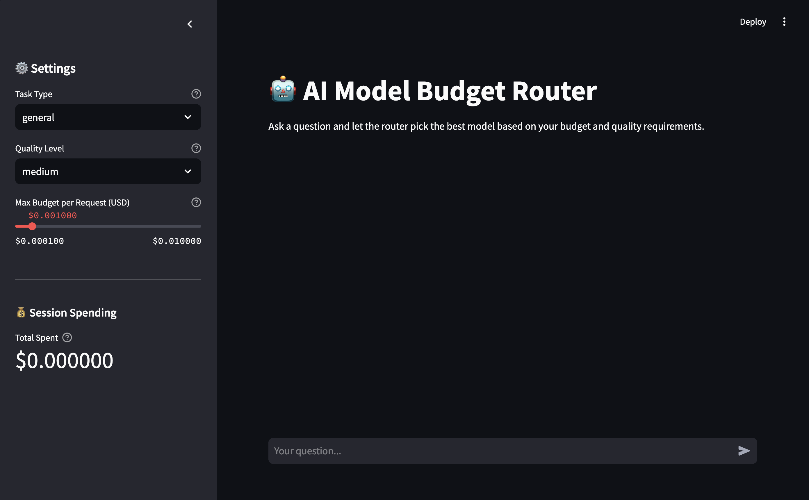

<h1 align="center">AI Model Budget Router</h1>

<p align="center">
  
  
  
  
  
</p>

<p align="center">
  Smart LLM routing by budget, task type, and quality — powered by Groq.
</p>

---



---

## Overview

AI Model Budget Router is a full-stack Python application that routes LLM prompts to the most suitable model based on three constraints: **budget**, **task type**, and **desired quality level**.

Instead of always calling the most expensive model, the router scores all available models, filters out those that exceed the budget, and selects the best fit. Costs are estimated before each API call and verified against actuals afterwards. All requests are logged and aggregated into a `/stats` endpoint.

The backend is a FastAPI REST API. The frontend is a Streamlit chat interface that lets you configure your budget and quality settings and see exactly which model was chosen and why.

---

## Features

- **Smart routing algorithm** — scores models by quality with a task-type specialisation bonus, then picks the best affordable option
- **Pre-call budget guard** — estimates token count and cost before calling the API; rejects requests that would exceed the budget
- **Actual cost tracking** — calculates real cost from the token counts returned by the Groq API
- **Request logging and stats** — aggregates total requests, total cost, average cost, and per-model usage
- **Groq API integration** — fast inference via an async HTTPX client
- **Streamlit chat UI** — interactive frontend with budget and quality controls and routing transparency
- **Interactive API docs** — auto-generated Swagger UI at `/docs`

---

## Tech Stack

| Layer | Technology |
|---|---|
| Language | Python 3.13 |
| Backend framework | FastAPI 0.115.6 |
| Data validation | Pydantic 2.10.4 |
| HTTP client | HTTPX 0.28.1 |
| ASGI server | Uvicorn 0.34.0 |
| Frontend | Streamlit 1.41.1 |
| LLM provider | Groq API |
| Config | python-dotenv 1.0.1 |

---

## Architecture

### Routing Algorithm

When a request arrives at `POST /route`, the router runs the following steps:

1. **Quality filter** — remove any model whose `quality_score` falls below the threshold for the requested quality level (`low` = 0, `medium` = 60, `high` = 75)
2. **Budget filter** — estimate the cost for each remaining model and remove those that exceed the user's budget
3. **Scoring** — assign each candidate its base `quality_score`, plus a +15 bonus if the model lists the requested `task_type` among its strengths
4. **Selection** — pick the highest-scoring candidate; break ties by choosing the cheapest option
5. **Fallback** — if no model meets the quality threshold, fall back to the cheapest affordable model regardless of quality

### Request Flow

```
User
  └─> Streamlit UI
        └─> POST /route
              ├─> select_model()         — routing algorithm
              ├─> estimate_cost()        — pre-call budget check
              ├─> call_llm()            — Groq API (async HTTPX)
              ├─> calculate_actual_cost()
              ├─> log_request()
              └─> RouteResponse
```

---

## Available Models

| Model ID | Name | Quality Score | Input ($/token) | Output ($/token) | Strengths |
|---|---|---|---|---|---|
| `llama-3.3-70b-versatile` | LLaMA 3.3 70B Versatile | 88 | $0.00000059 | $0.00000079 | general, code, summarize |
| `openai/gpt-oss-120b` | GPT-OSS 120B | 85 | $0.00000015 | $0.00000060 | general, code, email |
| `openai/gpt-oss-20b` | GPT-OSS 20B | 68 | $0.000000075 | $0.00000030 | general, email |
| `llama-3.1-8b-instant` | LLaMA 3.1 8B Instant | 55 | $0.00000005 | $0.00000008 | general |

---

## API Reference

### GET /health

Returns a simple status check.

**Response**
```json
{ "status": "ok" }
```

---

### POST /route

Routes a prompt to the best available model and returns the LLM response.

**Request body**

| Field | Type | Required | Description |
|---|---|---|---|
| `prompt` | string | Yes | The user's text prompt (1–10,000 chars) |
| `task_type` | string | Yes | One of: `general`, `code`, `email`, `summarize` |
| `budget` | float | Yes | Maximum spend in USD (must be > 0) |
| `quality` | string | No | One of: `low`, `medium` (default), `high` |

**Example request**
```bash
curl -X POST http://localhost:8000/route \
  -H "Content-Type: application/json" \
  -d '{
    "prompt": "Explain async/await in Python",
    "task_type": "general",
    "budget": 0.01,
    "quality": "medium"
  }'
```

**Example response**
```json
{
  "model": "llama-3.3-70b-versatile",
  "response": "Async/await is Python's syntax for writing asynchronous code...",
  "estimated_cost": 0.00000312,
  "actual_cost": 0.00000289,
  "tokens_used": 312,
  "routing_reason": "Best match: LLaMA 3.3 70B Versatile (score 103, est. cost $0.00000312)"
}
```

---

### GET /stats

Returns aggregated usage statistics for the current session.

**Example response**
```json
{
  "total_requests": 5,
  "total_cost": 0.000142,
  "average_cost": 0.0000284,
  "model_usage": {
    "llama-3.3-70b-versatile": 3,
    "llama-3.1-8b-instant": 2
  }
}
```

---

## Getting Started

### Prerequisites

- Python 3.13
- A Groq API key — sign up for free at [console.groq.com](https://console.groq.com)

### Installation

```bash
# 1. Clone the repository
git clone https://github.com/yourusername/ai-model-api-budget-router.git
cd ai-model-api-budget-router

# 2. Create and activate a virtual environment
python3.13 -m venv .venv
source .venv/bin/activate        # macOS / Linux
.venv\Scripts\activate           # Windows

# 3. Install dependencies
pip install -r requirements.txt
```

### Configuration

```bash
cp .env.example .env
```

Open `.env` and set your Groq API key:

```env
GROQ_API_KEY=your_groq_api_key_here
```

### Running the Application

Start the backend and frontend in two separate terminals.

**Terminal 1 — Backend**
```bash
uvicorn backend.app:app --reload
# API available at http://localhost:8000
# Swagger docs at http://localhost:8000/docs
```

**Terminal 2 — Frontend**
```bash
streamlit run frontend/dashboard.py
# UI available at http://localhost:8501
```

---

## Project Structure

```
ai-model-api-budget-router/
├── backend/
│   ├── app.py              # FastAPI app — all three endpoints
│   ├── routing.py          # Model selection algorithm
│   ├── model_config.py     # Model definitions and pricing
│   ├── budget_guard.py     # Pre-call budget enforcement
│   ├── cost_estimator.py   # Token and cost estimation
│   ├── llm_client.py       # Async Groq API client (HTTPX)
│   ├── logging_service.py  # Request logging and stats aggregation
│   └── schemas.py          # Pydantic request/response models
├── frontend/
│   └── dashboard.py        # Streamlit chat UI
├── docs/
│   └── images/
│       └── BudgetRouterIMG.png
├── logs/                   # Request logs (content gitignored)
├── .env.example
├── requirements.txt
└── README.md
```

---

## Roadmap

**Completed**
- Smart multi-model routing algorithm with quality and budget filtering
- Pre-call cost estimation and budget guard
- Groq API integration via async HTTPX
- Token estimation heuristics
- Request logging and `/stats` endpoint
- Streamlit chat UI with routing transparency
- Interactive API docs via FastAPI / Swagger

**Planned**
- Persistent log storage (SQLite or file-based)
- Cost dashboard with charts in Streamlit
- Per-session budget limits
- Rate limiting

---

## License

This project is licensed under the [MIT License](LICENSE).
